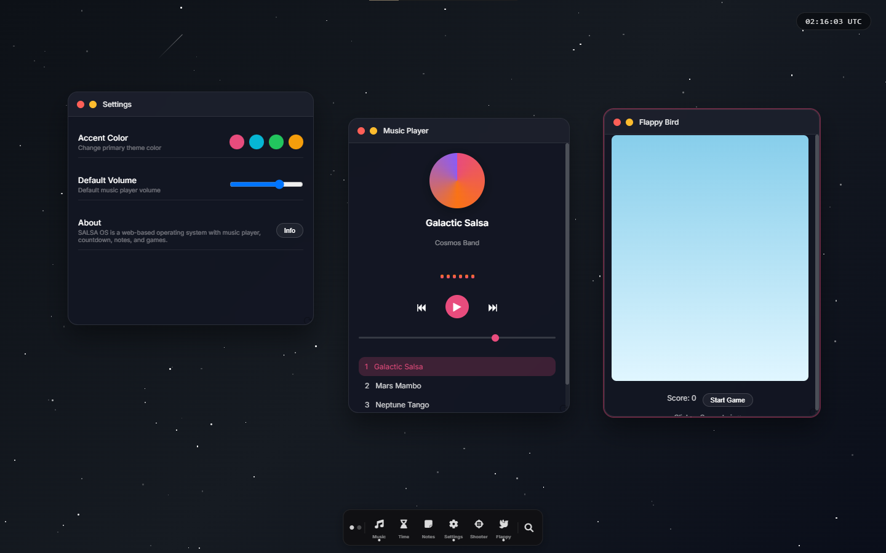

# 🎵 SALSA OS

> A web-based operating system interface with real-time music synthesizer, built for Hack Club Stardance

---

## 📖 About

**SALSA OS** is a browser-based desktop environment built with vanilla HTML, CSS, and JavaScript. No frameworks, no external dependencies — just pure web technologies.

The name combines **"SALSA"** (dance rhythm) with **"OS"** (operating system), creating a unique fusion of energetic Latin vibes and space exploration aesthetics.

---

## ✨ Features

### 🎵 Music Player
- Real-time arpeggio synthesizer using **Web Audio API**
- 4 unique melodic patterns (no copyright issues)
- Visual equalizer that dances with the beat
- Playlist with 4 original tracks
- Volume control with mute toggle

### ⏱️ Countdown Timer
- Countdown to **September 30, 2026** (Stardance deadline)
- Circular progress bar showing competition progress
- Daily motivational messages
- Real-time UTC clock

### 📝 Notes App
- Markdown support (**bold text**, headings, lists)
- Auto-save preview while typing
- LocalStorage persistence
- Copy to clipboard
- Export as `.txt` file

### 🎮 Games
- **Shooter Game** - Wave-based space shooter with combo system and lives
- **Flappy Bird** - Classic arcade game with high score tracking

### 🖥️ Window Management
- Draggable windows with smooth animation
- Resizable from bottom-right corner
- Minimize/Restore functionality
- Active window highlighting
- Position saved to localStorage

### 🧰 Taskbar
- macOS-style magnification on hover
- Active app indicators (dots)
- Application icons with labels

### 🔧 Workspace Switching
- 2 virtual workspaces
- Smooth window transition animation

### ⚙️ Settings
- Customizable accent color (4 presets)
- Default volume adjustment

### 🕺 Easter Egg
- Type **"SALSA"** anywhere on keyboard
- Activates disco mode with shaking windows and RGB flash

---

## 🛠️ Tech Stack

| Technology | Usage |
|------------|-------|
| HTML5 | Structure & semantic markup |
| CSS3 | Styling, animations, glassmorphism, Flexbox/Grid |
| Vanilla JS | All logic, window management, games |
| Web Audio API | Real-time arpeggio synthesizer |
| Font Awesome 6 | Vector icons |
| LocalStorage API | Persistence (window positions, notes, volume) |

---

## 🚀 Live Demo

🔗 **[Click here to try SALSA OS](https://fawwaznasuha12-afk.github.io/salsaOS/)**

---

## 📸 Screenshot

---

## 🎮 How to Use

| Action | Method |
|--------|--------|
| Open app | Click taskbar icon |
| Close app | Click red (●) button on window |
| Minimize app | Click yellow (●) button or Ctrl+M |
| Move window | Drag the window header |
| Resize window | Drag bottom-right corner (⟳) |
| Switch workspace | Click workspace dots (left side of taskbar) |
| Search apps | Click 🔍 icon or Ctrl+K |
| Volume | Use slider in Music Player or Settings |
| Change theme color | Settings → Accent Color |
| Easter egg | Type `SALSA` anywhere |

---

## 🧠 What I Learned

- Building a **Web Audio API** synthesizer from scratch
- Implementing **draggable/resizable windows** with boundary detection
- Creating **game loops** with requestAnimationFrame
- Managing **application state** in vanilla JavaScript
- Using **localStorage** for user preferences
- CSS **glassmorphism** and backdrop-filter effects
- **macOS-style dock magnification** with mouse tracking

---

## 🤖 AI Usage Declaration

AI assistants (Claude) were used to:
- Debug Web Audio API implementation
- Optimize CSS transitions and animations
- Suggest improvements for game mechanics

All core logic, design decisions, and final code review were done by me.

---

## 🙏 Acknowledgments

- **[Hack Club](https://hackclub.com)** for organizing Stardance
- **[NASA](https://www.nasa.gov)** for space inspiration
- **Font Awesome** for open-source icons

---

## 📄 License

MIT License — free to use, modify, and distribute.

---

## 👨‍💻 Author

Made with 💃 and 🚀 for **Hack Club Stardance 2026**

---

*"Dance like the stars are watching"* ✨
